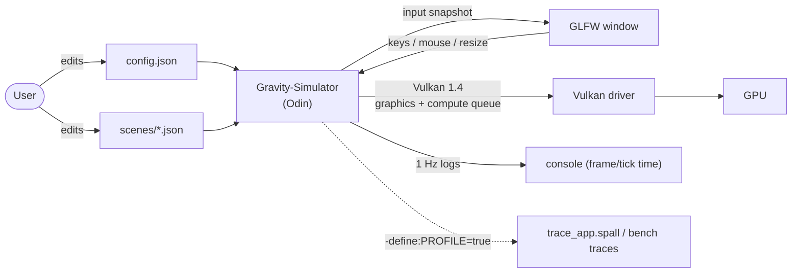
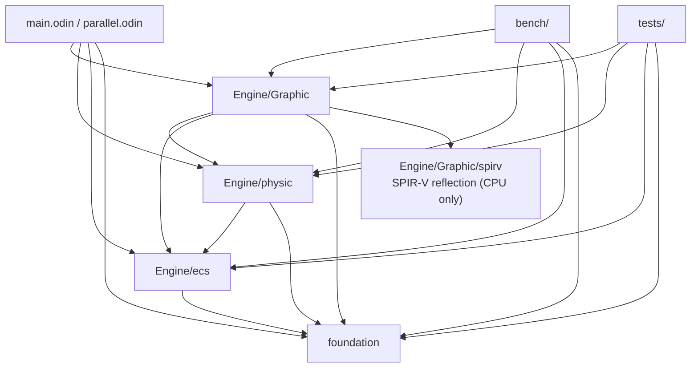
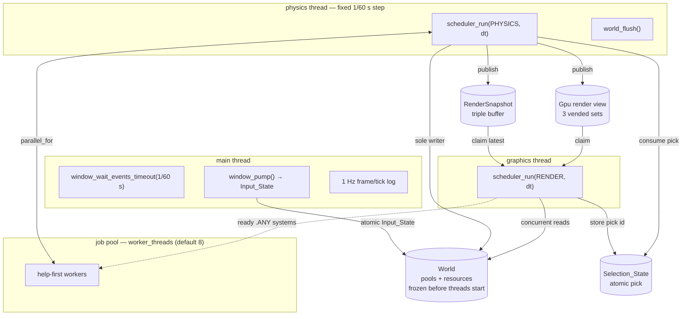
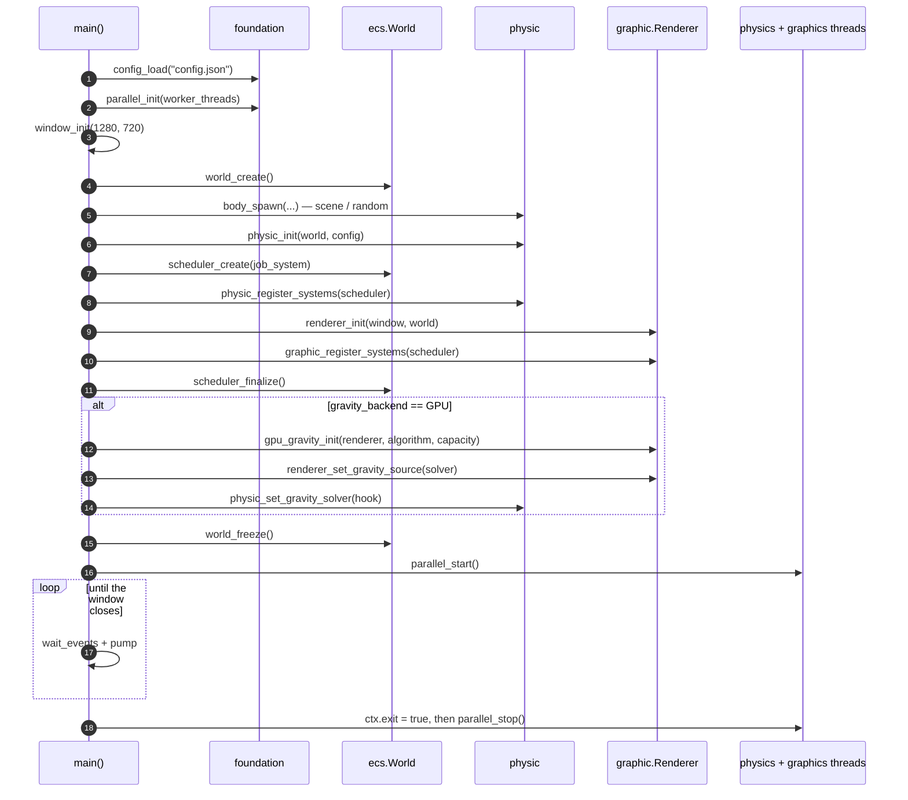
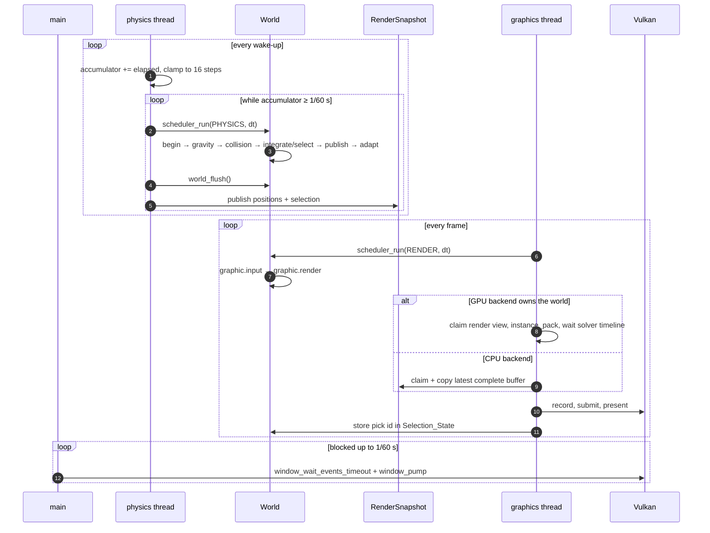
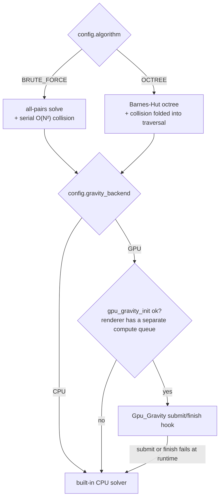
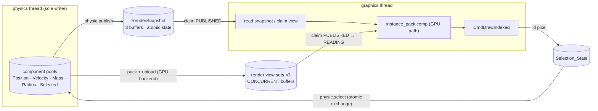

# Architecture

This is the map of the project: how the packages fit together, which threads
exist at runtime, and how a tick and a frame flow through the engine. It links
to the focused documents, which carry the subsystem diagrams:

- [`ecs.md`](ecs.md) — entity/component storage, the system scheduler, threading.
- [`physics.md`](physics.md) — the tick pipeline, Barnes-Hut octree, collision fold,
  adaptive tuning.
- [`renderer.md`](renderer.md) — data-driven Vulkan renderer and the frame graph.
- [`gpu_physics.md`](gpu_physics.md) — compute backends, GPU tree build, direct
  rendering.
- [`benchmark.md`](benchmark.md) — the bench harness and profiler.

## System context

The simulation is configured entirely from `config.json` and, in `FILE` mode,
one scene JSON in `scenes/`. The app opens one GLFW window, brings up one Vulkan
device (shared by the renderer and, optionally, the GPU physics backend), and
runs until the window closes.

## Module dependencies

`foundation` has no engine dependencies (config, arena, file I/O, the job pool,
the profiler). `physic` and `Graphic` both sit on `ecs`; `Graphic` additionally
depends on `physic` for the body view and snapshot types it renders. The `bench/`
and `tests/` packages are separate binaries that drive the same libraries.

## Runtime topology

Three long-lived threads plus a worker pool. The `World` has a single owner at a
time: the physics thread writes it, the graphics thread only reads frozen
registries.

- **GLFW belongs to the main thread.** The render phase never calls it; it reads
  the atomic snapshot `window_pump` publishes.
- **The physics thread owns every mutation**, including `world_flush`, which
  applies deferred structural changes.
- **The job pool is shared.** `parallel_for` (solver) and ready `.ANY` systems
  (scheduler) both submit to it, and a blocked thread helps run queued work.

## Startup sequence

All pools and resources must exist before `world_freeze`; after it the registries
are read-only so the two side threads can look values up concurrently (creating a
pool/resource after freeze is an error).

## Tick and frame lifecycle

The physics thread paces itself with an accumulator and runs zero or more fixed
steps per wake-up (`MAX_ACCUMULATED_STEPS` caps a slow solver rather than taking
an unstable step). The graphics thread renders as fast as the swapchain allows.

## Gravity backend selection

One `algorithm` chooses the solver *and* the collision strategy; `gravity_backend`
chooses who runs the solve. The GPU path is a backend of the CPU pipeline, never
a second engine.

The octree GPU hook also builds the tree on the GPU (`build_tree`); when any hook
step fails, the hook is uninstalled and the CPU solver runs for the current tick
and the rest of the run.

## Data ownership and handoff

The simulation pools never cross threads directly. Two handoff channels carry
state to the graphics thread: the CPU `RenderSnapshot` triple buffer, and (with a
GPU backend) the vended render-view sets.

The triple buffer is latest-wins and lock-free: the writer never blocks, the
reader always sees a complete version, and intermediate ticks are skipped. The
GPU render view is *vended* rather than shared, because a single set could be
overwritten by solve `T+1` before the frame reading solve `T` completes; see
[`gpu_physics.md`](gpu_physics.md).

## Where to go next

| Topic | Document |
|---|---|
| Entities, pools, scheduler graph, deferred changes | [`ecs.md`](ecs.md) |
| Solver, octree, collision fold, adaptive tuning | [`physics.md`](physics.md) |
| Vulkan wiring, frame graph, reflection, picking | [`renderer.md`](renderer.md) |
| Compute context, GPU tree build, direct rendering | [`gpu_physics.md`](gpu_physics.md) |
| Sweeps, spall traces, measured results | [`benchmark.md`](benchmark.md) |
