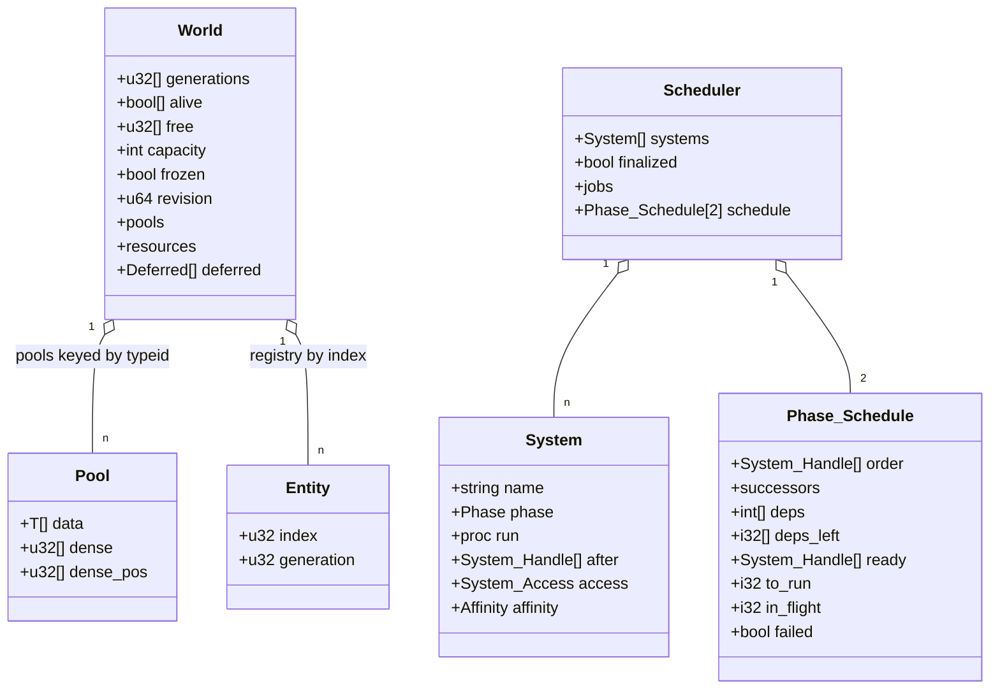
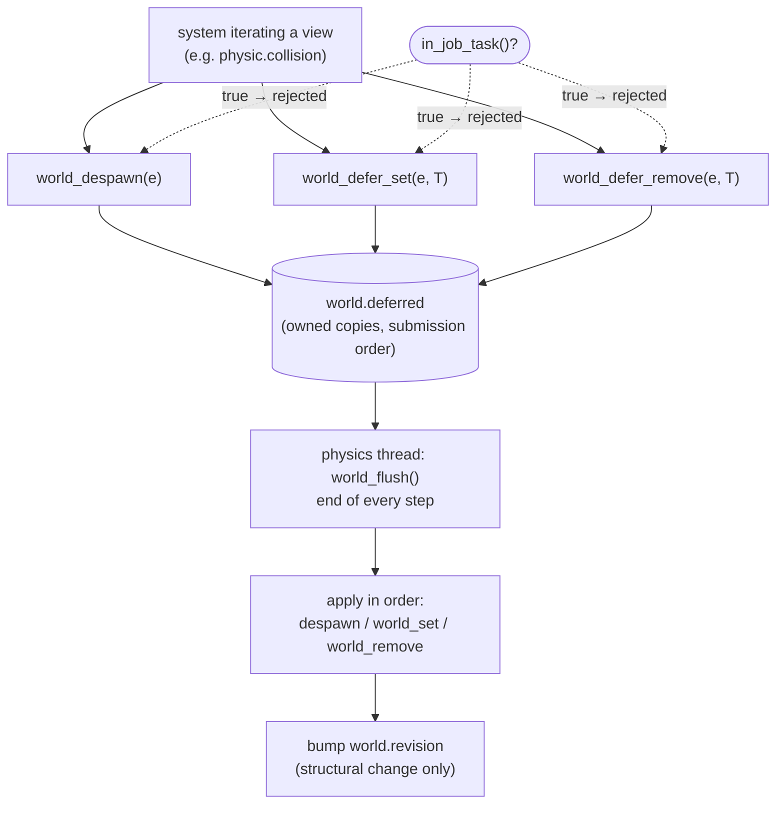
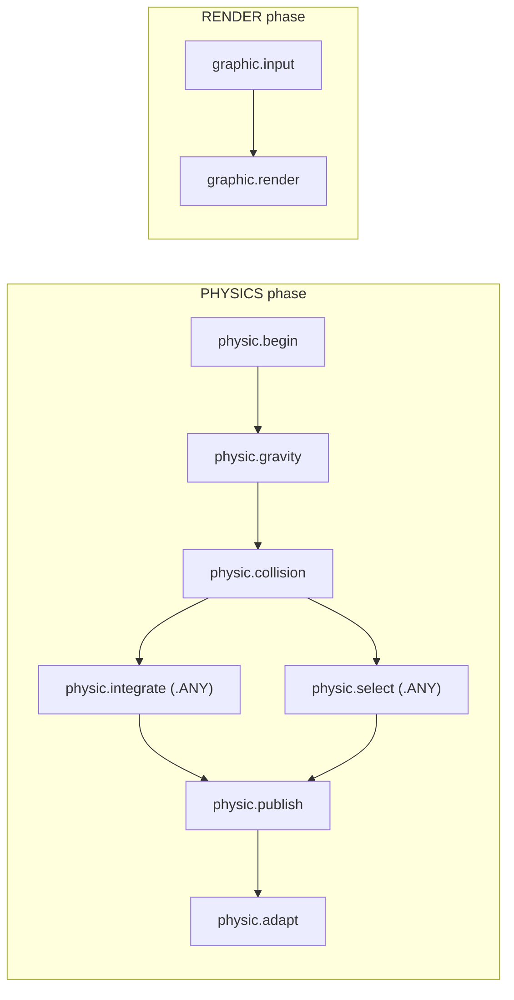
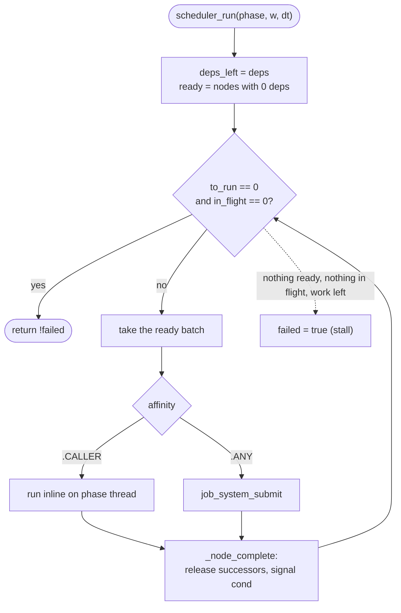
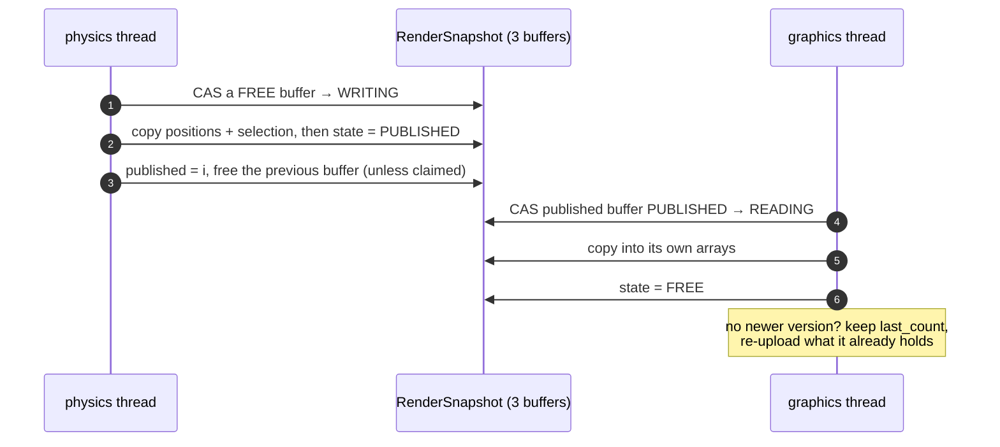

# ECS (`Engine/ecs`)

The engine is built around a small entity-component-system core. There is no
archetype graph: storage is a struct-of-arrays column per component, indexed by
`entity.index`.

- `Entity{index, generation}`. Despawning bumps the generation, so a stale
  handle can never alias the entity that reuses the index. A slot whose
  generation would wrap (`MAX_U32`) is retired instead of recycled.
- `Pool($T)` is the component column: `data` indexed by entity index, plus
  `dense`/`dense_pos` for O(1) swap-removal and iteration. Because every pool is
  indexed the same way, the entries for one entity line up across all of its
  components — no lookup is needed to walk several components together. That is
  what keeps the physics hot path cache-friendly.
- `World` owns the entity registry, the pools keyed by `typeid`, and the
  resources (singletons such as the solver state and the render snapshot).
  Access them with `world_pool(w, T)` / `world_resource(w, T)`; systems cache the
  returned pointer instead of looking it up in a loop.
- `world_set`/`world_remove` bump `world.revision` only on structural changes
  (component added/removed, spawn, despawn), never on value updates. Physics uses
  the revision to know when its octree is stale.
- Structural changes are deferred: `world_despawn`, `world_defer_set` and
  `world_defer_remove` queue an operation, and `world_flush` applies the queue in
  submission order. Systems may therefore destroy entities or add/remove
  components while iterating a view, and nothing aliases a live entity mid-tick.
  Only the world's owner thread calls `world_flush` (the physics loop does, at the
  end of every step).
- `world_validate(w)` checks the registry and every pool's dense bijection; use it
  in tests and when debugging.

## Data model

`Pool` is indexed by `entity.index` for every component type, so the columns for
one entity line up across all of its components without a lookup. `dense` holds
the live indices (the iteration order) and `dense_pos` maps an index back to its
slot for O(1) swap-removal.

## Deferred structural changes

Systems may queue despawns and component add/remove while iterating a view; the
owner thread applies them at the end of the step.

## Capacity and freezing

Columns never relocate once the world is frozen, which is what makes borrowed
views safe to hold across a system and across the two threads:

- `world_reserve(w, max_entities)` sizes the entity registry and every pool to
  the maximum number of live entities. Spawns reuse freed indices, so this bounds
  the index space for the whole run. Pools created after the call are sized
  automatically.
- `world_freeze(w)` marks the registries read-only. After this point all pools and
  resources must already exist: `world_pool`/`world_resource` log an error and
  return `nil` for a new type (the typed accessors such as `physic_state` and
  `body_view` assert on the `nil` in debug), because creating one would race with
  the other thread. Spawning past the reserved capacity returns `ENTITY_NONE` and
  logs; writing a component past capacity is a no-op + warning.

The app reserves from `config.json` (`num_objects` or the scene file), spawns, and
freezes after the renderer registers its resources and before the threads start.
The bench does the same per world.

## Groups and views

Odin has no variadic type parameters, so a generic query API is not practical.
A **view** is instead declared by the package that owns the components: a struct
of borrowed column slices plus the driver `dense` list, always indexed by entity
index. `physic.Bodies` is the only one.

The view's contract is that every entity in the driver list carries *all* the
columns. `body_spawn` is the only constructor and adds them together, and
`body_view` verifies co-presence under `ODIN_DEBUG`. Components must be plain
data (POD): `pool_set` overwrites and `pool_remove` clears without running a
destructor, so an owning component would leak.

## Physics as ECS

The physics components (`Position`, `Velocity`, `Acceleration`, `Mass`,
`Radius`, `Selected`) live in the physical body's pools; `Body` is a tag marking
the entities the simulation iterates, and its `dense` list is the canonical body
list. `Physic_State` is a world resource holding the solver and adaptive-tuning
state, including the index-based `OctTree`. The `PHYSICS` phase runs, in order:
`begin` (reset acceleration, ensure tree), `gravity`, `collision`, `integrate`,
`select` (apply a picked instance from the graphics thread to `Selected`),
`publish` (copy positions and selection into `RenderSnapshot`), `adapt`
(adaptive controller). `physic_register_systems` wires them up.

## Graphics as ECS

The Vulkan `Renderer` is owned by `main` and published as a `Renderer_Ref`
resource; the `Camera` and the `Window_Ref` are world resources.
`graphic_register_systems` adds two `RENDER`-phase systems: `graphic.input`
mutates the camera from the keyboard, and `graphic.render` runs the frame
through the renderer resource. A graphics system returns `false` only on a fatal
error; the scheduler aborts the phase and the graphics thread shuts the app down.

GLFW is not thread-safe, so the `RENDER` phase performs no window queries. The
**main** thread pumps events and then calls `window_pump`, which queries GLFW and
publishes an atomic input/window snapshot (key bitmask, mouse button, normalised
cursor, framebuffer size) on `Window`. `graphic.input` consumes that snapshot to
move the camera and to turn a left-click edge into a `Pick_Request`, and the
swapchain reads the snapshot's cached framebuffer size when it is recreated.

The frame itself is data-driven. `Engine/Graphic/frame_graph.json` declares the
resources (imported or transient) and the passes (`inputs`/`outputs`, `bindings`,
`optional`). `frame_graph.odin` loads it, resolves pipelines, builds the
dependency edges and, every frame, culls disabled/unused passes, topologically
sorts the rest and executes it: it emits the layout barriers derived from each
resource's usage and opens the rendering scope around the pass's record callback.
Passes are bound to code by name in the renderer (`_renderer_record_pass`), so the
JSON owns the structure and the code owns the draw calls.

The main pass writes both the swapchain color and, as a second output (MRT), a
1-based instance ID to a transient `R32_UINT` target owned by the graph. On a left
mouse press the optional `pick_copy` pass records a one-pixel copy of that ID into
the frame command buffer (no separate draw and no extra submission), so the result
is read once the frame's fence signals. The resolved index is handed to the
physics thread through the atomic `Selection_State`; `physic.select` consumes it
with an atomic exchange (so a pick stored between a load and a clear is never
lost), applies it to `Selected`, and the next snapshot publishes the flags.

## Scheduler

Systems are plain `proc(w, dt) -> bool` grouped by `Phase` (`PHYSICS` /
`RENDER`). `scheduler_add` returns a `System_Handle`, and systems declare what
they must run after with `after = {handles}`. Because a handle only exists for an
already-registered system, every edge points backwards: the graph is acyclic by
construction.

`scheduler_finalize` resolves each phase into an execution graph. It takes the
explicit `after` edges, adds access-conflict edges for **every** conflicting
pair (writer vs anything) regardless of affinity — added forward along a
deterministic topological order — and stores each node's successors and
dependency count:

- `.CALLER` (default) systems are pinned to the phase thread. They are the safe
  choice for anything that mutates structure, calls `parallel_for` or touches the
  renderer.
- `.ANY` systems must declare `access = {reads, writes}` (component/resource
  `typeid`s); a `.ANY` system with no declaration is rejected at finalize, as is
  one outside the owner phase (`PHYSICS`-only), because it would run concurrently
  with the physics thread.

Access declarations serialise across affinities: a `.CALLER` writer and an
`.ANY` reader of the same `typeid` get a dependency edge, so they cannot run
concurrently (the caller inline on the phase thread while the reader sits on the
pool). `.CALLER` systems that declare nothing are unaffected, since an empty
access never conflicts.

The two phases as currently registered (edge = dependency; `.ANY` systems may be
dispatched to the pool):

`physic.integrate` and `physic.select` touch disjoint columns and share a wave;
their access declarations serialise them against conflicting systems across
affinities.

`scheduler_run` drives one phase to completion: a system becomes **ready** when
all of its predecessors have finished. Ready `.CALLER` systems run inline on the
phase thread; ready `.ANY` systems are submitted to the shared job pool
(`foundation/job.odin`). Each completion releases its successors and wakes the
runner, which dispatches the newly ready work. The phase finishes when the
remaining count reaches zero.

A failure sets the phase's failed flag; no further work is released, in-flight
systems finish, and `scheduler_run` reports false. A stall — systems remain, but
none is ready and none is in flight — is treated the same way, so an incomplete
phase is never reported as success. A debug build keeps `.ANY` systems on the
phase thread (same graph, serial execution) so validation and determinism are
easy to reason about. Deferred structural changes are still applied by the owner
(`world_flush`), never by the scheduler: a phase may run on a non-owning thread.

## Threading

The world is not synchronised; one thread owns it at a time. All pools and
resources are created during `physic_init`/`renderer_init` and the world is
frozen before the threads start, so afterwards the graphics thread only performs
concurrent reads of the registries. The physics thread owns all mutations and
runs `world_flush`.

The render handoff is a lock-free triple buffer (`RenderSnapshot`): the physics
thread copies the published view into a free buffer and atomically publishes it,
and the graphics thread claims the latest published buffer, copies it and
releases it. The writer never blocks and the reader always sees a complete
version; if the reader is behind, intermediate ticks are skipped and rendering
keeps the last complete frame. The graphics thread never touches the pools — the
one debug check that needs the body columns (the direct-render instance
verification under `ODIN_DEBUG`) reads the published snapshot through the same
triple buffer, never `body_view`.

`foundation` exposes one help-first job pool shared by the physics solver
(`parallel_for`) and the scheduler's ready `.ANY` systems. Workers and any thread
blocked in `job_system_wait` pull from the same queue, so a job may submit
children and wait for them without deadlocking. Only the owner phase may run
`.ANY` systems; structural operations (`world_spawn`/`despawn`, `world_defer_*`,
`world_flush`, and `world_set`/`remove` that would add or drop a component)
reject calls made from inside a job task.

