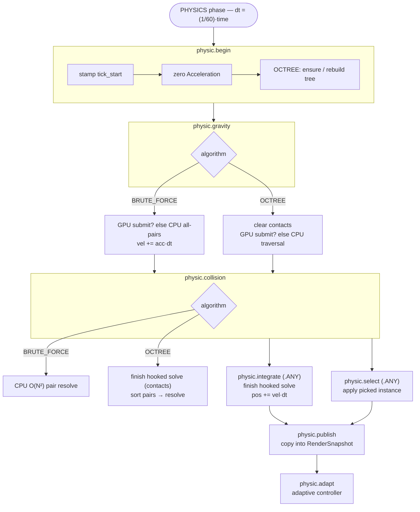
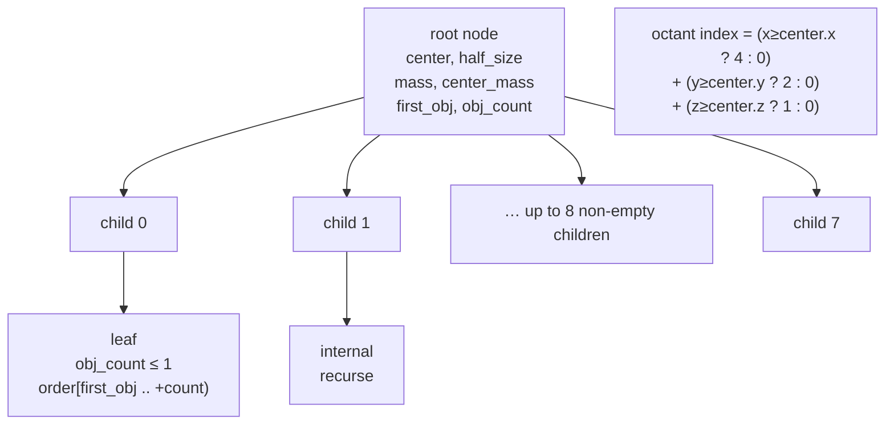
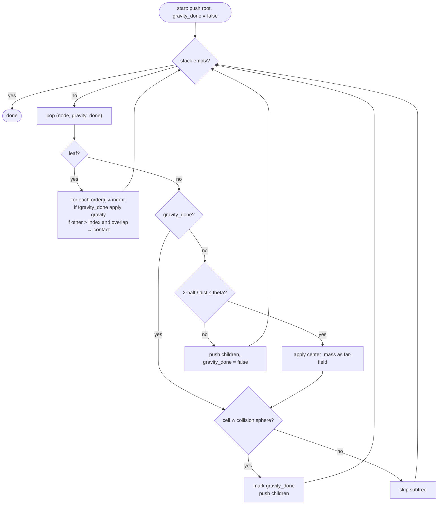
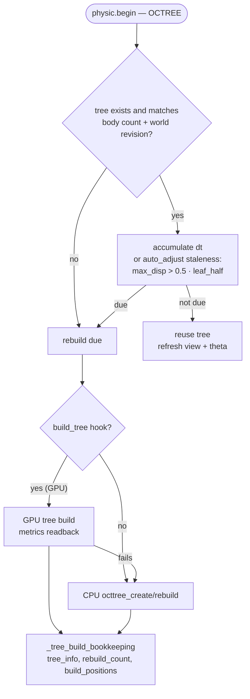
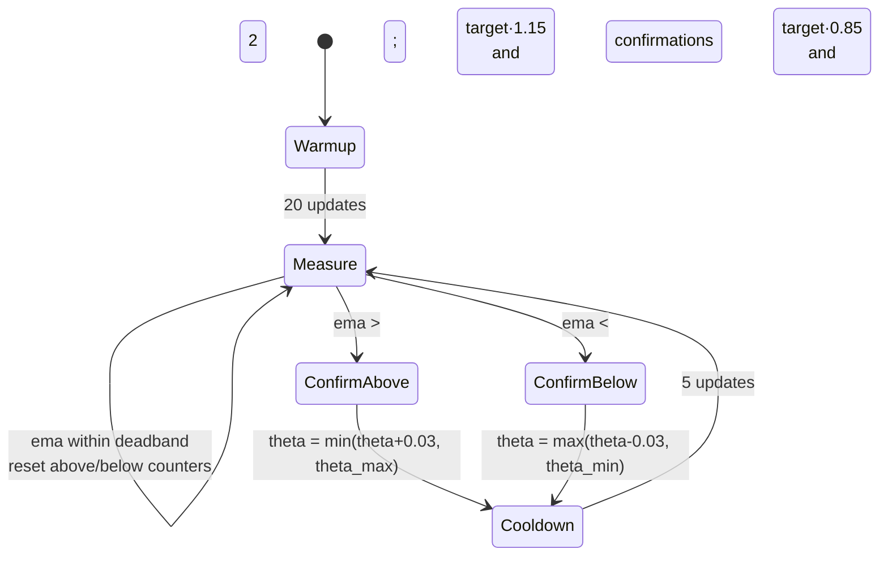

# Physics

Config selects one algorithm (`algorithm`) used by both collision detection and gravity solving (BRUTE_FORCE or OCTREE). The OctTree implements Barnes-Hut with center-of-mass approximation and stores entity indices, so it does not dangle when pools grow.

`gravity_backend` selects who runs the gravity solve: `CPU` (the built-in solver) or `GPU` (a compute backend implemented in `Engine/Graphic`, see `docs/gpu_physics.md`). With `BRUTE_FORCE` the GPU runs the tiled all-pairs kernel; with `OCTREE` it builds the tree on the GPU, walks it with the same collision fold and returns the contact pairs for the unchanged serial narrow phase. Physic still owns the rebuild decision and only falls back to the CPU builder when the GPU backend fails. Either way the backend owns the velocity update (`vel += acc * dt`), so physic integrates positions and resolves collisions for every backend. The hook is asynchronous: `physic.gravity` submits the solve, and the first consumer finishes it — collision for the octree fold, `physic.integrate` for the brute-force solve, which therefore overlaps the collision pass. A hook is only usable with **both** a `submit` and a `finish` callback: a half-specified hook is rejected before it submits, and a failed (or missing) finish uninstalls the hook — the CPU solver then runs for the current tick and the rest of the run. When it does, the CPU octree fallback rebuilds `state.tree` whenever it does not match the world (nil, different body count, or a different world revision), so it can never reuse a tree built for a different body set.

Octree collision is **folded into the gravity traversal**: a node accepted by the opening angle is still descended into when its cell intersects the collision sphere (children marked `gravity_done` so the approximation is applied exactly once), so `theta` can never hide a contact and gravity results are bit-identical. The traversal appends the overlapping pairs, and the serial narrow phase then displaces each pair (resolution is order-dependent, so it cannot be parallelized without changing the result). Pairs are sorted before resolution so the outcome is deterministic regardless of scheduling.

Zero-mass bodies are skipped instead of dividing by zero (logged once): gravity divides the pair force by the accelerated body's mass and the collision resolve divides the overlap by the pair's total mass, so either case would otherwise produce `NaN`. Results for positive masses are unchanged.

The physics thread runs a **fixed-timestep** loop: one `PHYSICS` phase every 1/60 s of real time, each advancing `(1/60) * time` sim-seconds. An accumulator paces the loop; if the solver cannot keep up, the accumulator caps at 16 pending steps (the sim slows down rather than taking huge, unstable timesteps).

The octree gravity solver is split across `worker_threads` via `foundation.parallel_for`, which schedules one job per adaptive chunk on the shared help-first job pool (see `docs/benchmark.md`). The tree itself is read-only during solve, so per-body queries are embarrassingly parallel.

Hot-path traversal stacks (`_calc_force`, `_calc_force_collect`) skip zero-initialization; every slot is written before it is read. Zero-initializing them cost ~5–12% of the tick at 100k bodies with `theta >= 0.75` (measured with the fold enabled; without it the effect was larger). Every traversal stack is fixed at `TRAVERSAL_STACK_SIZE` (4096) entries; with `max_depth <= MAX_DEPTH_CAP` (48) and at most 8 children per node a depth-first walk can hold at most `(48 + 1) * 8 = 392` entries, so the bound has an order of magnitude of headroom (pinned by a compile-time `#assert` next to the constant). A full stack, or a full `octtree_collect_nearby` result buffer (the callers size it to the body count), is a hard error — logged once and asserted in debug — because dropping nodes or candidates would silently produce wrong forces or miss contacts.

Each tick publishes body positions and selection flags into the `RenderSnapshot` resource; on the CPU backends the graphics thread reads that snapshot (a GPU backend instead hands the renderer the solver's device buffers, see `docs/gpu_physics.md`), never the simulation pools. The handoff is a triple buffer with atomic state per buffer (no mutex): the physics thread publishes the latest complete version and the graphics thread claims and releases it, skipping versions it does not need.

## Tick pipeline

One `PHYSICS` phase is one fixed step (`dt = (1/60) · time`). The systems run in
the dependency order below; `physic.integrate` and `physic.select` share a wave
because they touch disjoint columns.

The hooked-solve rule: `physic.gravity` submits without waiting; the first
consumer calls `finish`. The octree fold sets `finish_at_collision`, so collision
finishes it; the brute-force solve leaves it in flight across the collision pass
and `physic.integrate` finishes it. A failed submit or finish uninstalls the hook
and re-runs the CPU solver for that tick.

## Octree (Barnes-Hut)

The tree subdivides the body bounds into eight octants per level. A node stores
its cell, the aggregate mass/center of mass and the range of body indices in the
tree's own permuted `order` list. Leaves hold `obj_count <= 1` (or stop at
`max_depth` / `min_half`).

The opening angle `theta` decides when a node is far enough to approximate by
its center of mass: `(2 · half_size) / distance <= theta`.

### Traversal with the collision fold

`_calc_force_collect` is `_calc_force` plus contact collection. A node accepted
by theta still has its children visited when its cell intersects the inflated
collision sphere, and the subtree is marked `gravity_done` so gravity is applied
exactly once — so `theta` can never hide a contact and gravity stays bit-identical
to `_calc_force`.

### Rebuild decision

`physic.begin` decides whether the tree must be rebuilt (structural change,
interval, or adaptive staleness). While a GPU `build_tree` hook is installed the
build itself happens on the GPU and only the metrics come back.

## Adaptive tuning (`auto_adjust`)

When `auto_adjust` is `true`, the physics system measures its own per-update cost (EMA-smoothed) and adjusts two values to keep cost near `(1000 / target_tickrate) * 0.85` ms (85% headroom so the fixed-step loop can keep up). `tick_start` is stamped at the start of every tick — including one with no bodies — so emptying and repopulating the world does not report the idle gap as a single enormous update:

- **`theta`** (cost-feedback): raised when over budget (cheaper traversal), lowered toward `theta_min` when under budget (more accurate). `theta`/`theta_max` bound it. The tree's traversal theta is refreshed every update, so changes take effect immediately.
- **Rebuild interval** (motion/staleness-driven): the tree is rebuilt when the maximum object displacement since the last build exceeds `0.5 ×` the median leaf cell size. Fast-moving sims rebuild often; slow/static ones rarely. `tree_rebuild_interval` remains as an upper cap in sim-seconds. Keeping the tree fresh also keeps `theta` effective (aged trees degrade to ~constant traversal cost regardless of theta).

Convergence is smoothed (EMA α=0.1, 20-update warmup, 2-consecutive-out-of-band confirmations, ±15% deadband). If the target is unreachable (e.g. too many objects), the knobs pin at their bounds and the sim simply runs as fast as the hardware allows.

`theta` is the cost knob; the rebuild interval is the freshness knob (rebuild when
the maximum body displacement since the build exceeds `0.5 ×` the median leaf
cell size). A stale tree degrades traversal cost roughly independently of `theta`,
so the rebuild stays close enough for `theta` to matter.

## App flow

On launch the app loads `config.json`, creates a `World`, spawns the initial bodies accordingly (random or from a scene file), calls `physic_init` and builds a `Scheduler` with the physics systems. With `gravity_backend = GPU` it then attaches the compute solver to the renderer's device (buffers pre-sized for the body count) and installs it as the gravity solver. The renderer is initialised against the same world. Two threads run until the window closes: physics runs the `PHYSICS` phase on a fixed step (flushing deferred structural changes after each step), graphics runs the `RENDER` phase, whose `graphic.input` and `graphic.render` systems update the camera and draw the frame. The **main thread pumps events** — blocking in `window_wait_events_timeout` (1/60 s) rather than busy-polling, since a tight `glfwPollEvents` loop burns a full core in the GLib/libdecor event machinery — and then calls `window_pump` to publish the input/framebuffer snapshot the render phase reads (GLFW is not threaded). Frame/tick timings are logged to the console once per second.
